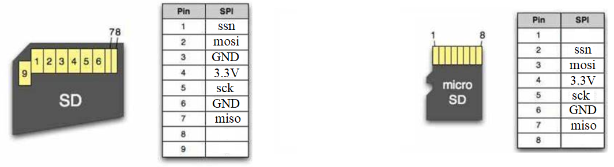

-CAD09D.svg)  

FPGA SDcard File Reader (SPI)
===========================
基于 FPGA 的 SD卡文件读取器（通过 SPI 总线），指定文件名，读出文件内容。

能够自动适配 **SD卡版本** ，自动适配 **FAT16/FAT32文件系统**。

|           |    SDv1.1 card     |     SDv2 card      |    SDHCv2 card     |
| :-------: | :----------------: | :----------------: | :----------------: |
| **FAT16** | :heavy_check_mark: | :heavy_check_mark: | :heavy_check_mark: |
| **FAT32** | :heavy_check_mark: | :heavy_check_mark: | :heavy_check_mark: |


# 背景知识

SD卡最常用的接口总线是 SD总线，然而它也支持 SPI 总线， SPI 的复杂度和对时序的要求低于 SD 总线，适合使用单片机来读写。

SD 卡和 microSD 卡的 SPI 接口的引脚定义如下图（SD卡和microSD卡除了外形尺寸外，功能上没有差别）。

|                          |
| :-----------------------------------------------: |
| 图：SD 卡（左）与 microSD 卡（右）的 SPI 引脚定义 |

SD卡本身只是一大块线性的数据存储空间，分为多个扇区 (sector)，每个扇区 512B ，底层的读取和写入操作都以扇区为单位。为了在这片线性的存储空间中组织磁盘分区和文件，人们规定了一种复杂的数据结构——文件系统，SD卡最常用的文件系统是 FAT16 和 FAT32 。

要从 SD 卡中读取文件数据，本库分为两个功能模块：

- 按照 SD 总线标准操控 SPI 总线，能够读取扇区。
- 在能够读取扇区的基础上，解析文件系统，也就是给定文件名，找到文件所在的位置和长度。实际上文件可能是不连续存储的（被拆成多块放在不同地址），本库会正确地处理这种情况。


# 如何调用本模块

RTL目录中的 sd_spi_file_reader.sv 是 SD卡 SPI 文件读取器的顶层模块，它的定义如下：

```
module sd_spi_file_reader #(
    parameter FILE_NAME = "example.txt",
    parameter SPI_CLK_DIV = 50
)(
    input  wire       rstn,   // rstn active-low, 1:working, 0:reset
    input  wire       clk,    // clock 
    // SDcard spi interface
    output wire       spi_ssn, spi_sck, spi_mosi,
    input  wire       spi_miso,
    // status output (optional for user)
    output wire [1:0] card_type,         // SDv1, SDv2, SDHCv2 or UNKNOWN
    output wire [3:0] card_stat,         // show the sdcard initialize status
    output wire [1:0] filesystem_type,   // FAT16, FAT32 or UNKNOWN
    output wire [2:0] filesystem_stat,   // show the filesystem initialize status
    output reg        file_found,        // 0=file not found, 1=file found
    // file content data output (sync with clk)
    output reg        outen,             // when outen=1, a byte of file content is read out from outbyte
    output reg  [7:0] outbyte            // a byte of file content
);
```

其中：

- `FILE_NAME` 指定要读的目标文件名，`SPI_CLK_DIV` 是时钟分频系数，它的取值需要根据你提供的 clk 的时钟频率来决定（详见代码注释）。
- `clk` 是模块驱动时钟。
- `rstn` 是复位信号，在开始工作前需要令 `rstn=0` 复位一下，然后令 `rstn=1` 释放。
- `spi_ssn` 、 `spi_sck` 、 `spi_mosi` 、 `spi_miso` 是 SPI 总线信号，需要连接到 SD 卡。
- `card_type` 输出检测到的 SD 卡的类型：0对应未知、1对应SDv1、2对应SDv2、3对应SDHCv2。
- `file_system_type` 输出检测到的 SD 卡的文件系统：0对应未知、1对应FAT16、2对应FAT32。
- `file_found` 输出是否检测到目标文件：0代表未找到，1代表找到。
- 模块会逐个输出目标文件中的所有字节，每输出一个字节，`outen` 上就产生一个高电平脉冲，同时该字节出现在 `outbyte` 上。


运行示例工程
===========================

example-vivado-readfile 文件夹中包含一个 vivado 工程，该示例在 [Nexys4开发板](http://www.digilent.com.cn/products/product-nexys-4-ddr-artix-7-fpga-trainer-board.html) 上运行（因为 Nexys4 开发板有 microSD 卡槽，比较方便），它会从SD卡根目录中找到文件 example.txt 并读取其全部内容，然后用 UART 发送出给PC机。

按以下步骤运行该示例：

1. 准备一张 **FAT16** 或 **FAT32** 的 **microSD卡** 。如果不是 **FAT16** 或 **FAT32**，则需要格式化一下 。 
2. 在根目录下创建 **example.txt** (文件名大小写不限) ， 在文件中写入一些内容。
3. 将卡插入 Nexys4 的卡槽。
4. 将 Nexys4 的USB口插在PC机上，用 **串口助手** 或 **Putty** 等软件打开对应的串口。
5. 用 vivado 打开目录 example-vivado-readfile 中的工程，综合并烧录。
6. 观察到串口打印出文件内容。
7. 同时，还能看到 Nexys4 上的 LED 灯发生变化，它们指示了SD的状态和类型，具体含义见代码注释。
8. 按下 Nexys4 上的红色 CPU_RESET 按钮可以重新读取，再次打印出文件内容。


# 相关链接

* [FPGA SD卡读取器 (SD总线版本)](https://github.com/WangXuan95/FPGA-SDcard-Reader/) ：与该库功能相同，但通过**SD总线**。
